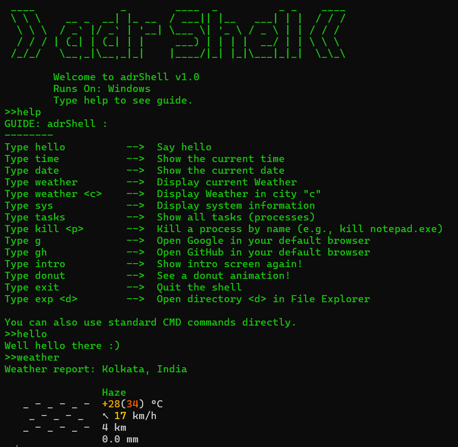
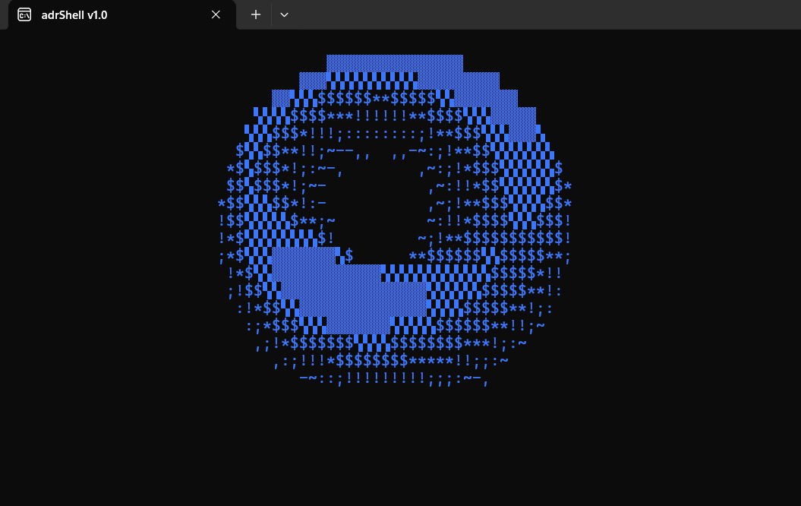
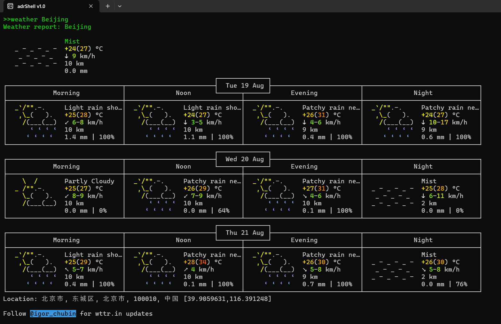

## adrShell v1.0

A lightweight **custom CLI wrapper for Windows**, built in C++.
It provides an interface with shortcuts for everyday commands like
weather, system info, task management, and ASCII art animations.

---

### Requirements
- Windows OS
- MinGW or MSVC (C++ compiler)
- `curl` installed (for weather + donut)

---

### Screenshots

* **adrShell Interface**

* **ASCII Donut**
  

* **Weather in a City**
  
---

### Build Instructions
```bash
g++ src/shell.cpp -o shell.exe
````

---

### Installation

1. Put the compiled `.exe` file inside:

   ```
   C:/Tools/
   ```
2. (Optional) Rename it to something shorter like `adr.exe`.
3. Add `C:/Tools/` to your **Path environment variable**:

   * Press `Win + R`, type `sysdm.cpl`
   * Go to **Advanced > Environment Variables**
   * Edit **Path** → Add `C:/Tools/`
4. Open a new CMD prompt and run:

   ```bash
   <name-of-exe>
   ```

   Example:

   ```bash
   adr
   ```

---

### Notes

* Type `help` in adrShell to see available commands.
* You can also run **regular CMD commands** directly.

